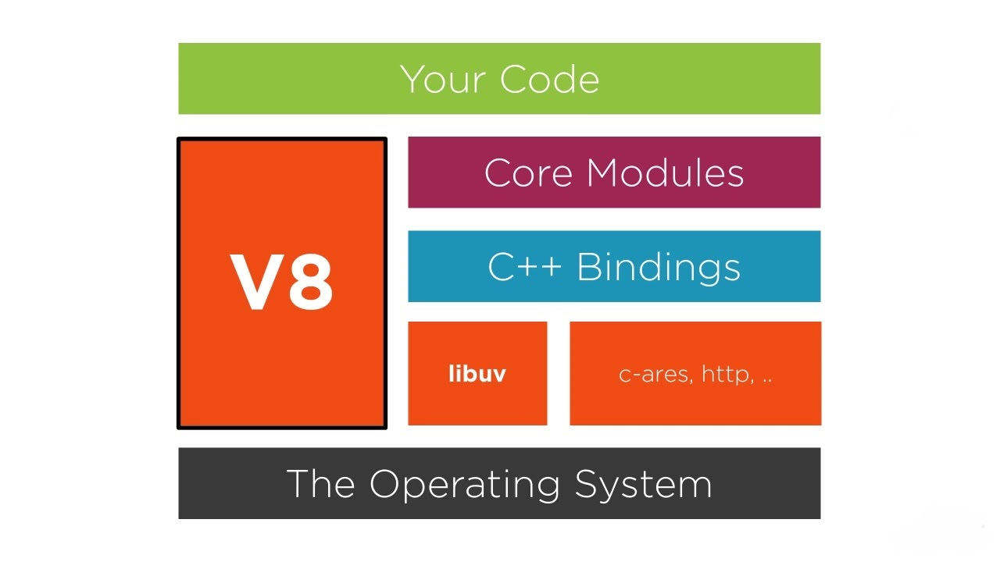

# Architecture

## Node VM

    - v8, Default, Single-Threaded
    - Chakra by Microsoft, powers Edge browser

VM executes Javascript code. So, v8 actually executes your JS code.

## v8 Feature Groups

    - Shipping - Available by default
    - Staged - Not quite ready yet. flag `--harmony`
    - In-Progress - Less stable.

You can see the list of all group features by 

```js
node --v8-options | grep "in progress"
node --v8-options | grep "staged"
```

## Node Architecture Ovevrview



Node is more than a wrapper for v8, it provides APIs for working with file system, operating system, binary data, networking and much more. It mainly constitues of the following components.

### v8

Node v8 uses v8 C++ API. So, node API eventually executes C++ code using V8 object and function templates.

When node is done waiting for IO or timers, it usually has callback functions to invoke back to. When it's time to invoke these callbacks, node passes control from libuv to v8 engine. When v8 executes the callback, it passes control to Node itself. 

When control is with v8, Node can not execute any Javascript code as v8 is *single-threaded*. Node will simply wait until v8 is ready for more operations. 

This is actually programming in node so simple yet powerful as we don't have to worry about locks or race condition. There is only one thread where our Javascript code runs.

### libuv

`libuv` is a C library developed for Node, but now it's used by Rust, Julia and others. It's used to abstract the non-blocking I/O operations. It provides a consistent interface across many operating systems. 

It handles operations on file system, TCP/UDP sockets, child processes and others. `libuv` includes a threadpool to handle what can't be done asynchronously at OS level. 

`libuv` also provides Node with Event Loop.

### More Dependecies

Apart from v8 and libuv, Node has a few more dependecies.

1. http-parser: Library for parsing HTTP messages. It works for requests and responses, works with a very small memory footprint.

2. c-ares: Enables performing asynchronous DNS queries.

3. OpenSSL: Mostly used in `tls` and `crypto` modules. Provides implementation for many cryptographic functions

4. zlib: Used for fast streaming compression and decompression interfaces.
